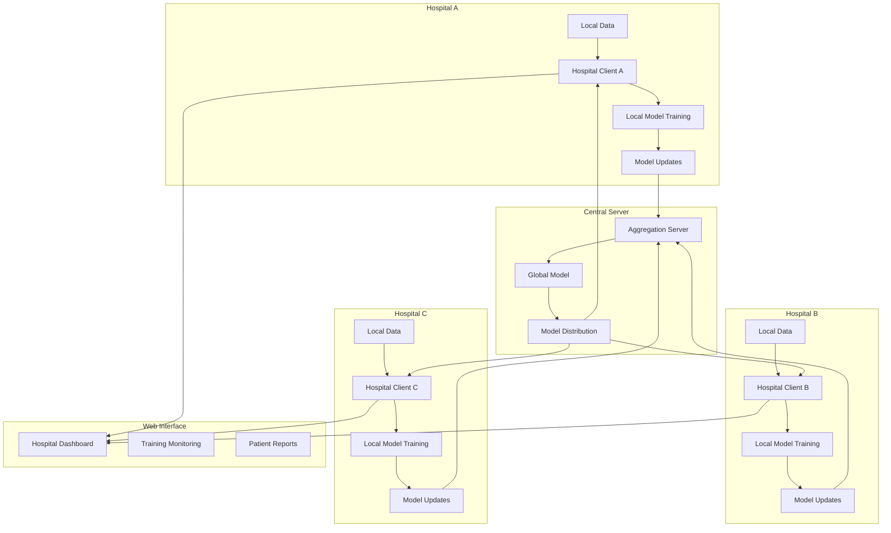

# Design Document: Federated Medical AI System

## Overview

This system implements a federated learning architecture for medical image classification, specifically targeting fetal position detection from ultrasound images. The design prioritizes data privacy, clinical accuracy, and scalable deployment across healthcare networks.

## Architecture



## Components and Interfaces

### 1. Federated Learning Server (`server/`)

**Core Components:**
- `server.py`: Flask-based coordination server managing client connections
- `aggregator.py`: Implements FedAvg algorithm for model parameter aggregation

**Key Interfaces:**
```python
class FederatedServer:
    def register_client(client_id: str) -> bool
    def aggregate_models(client_updates: List[ModelUpdate]) -> GlobalModel
    def distribute_global_model() -> ModelParameters
    def get_training_status() -> TrainingStatus
```

### 2. Hospital Client (`client/`)

**Core Components:**
- `client.py`: Hospital-side federated learning client
- `trainer.py`: Local model training and evaluation logic

**Key Interfaces:**
```python
class HospitalClient:
    def load_local_data(data_path: str) -> DataLoader
    def train_local_model(epochs: int) -> ModelMetrics
    def send_model_update() -> bool
    def receive_global_update() -> ModelParameters
```

### 3. Medical AI Model (`models/`)

**Architecture:**
- Convolutional Neural Network optimized for medical image classification
- Three-class output: Cephalic, Breech, Transverse
- Transfer learning from pre-trained medical imaging models

**Model Interface:**
```python
class FetalPositionClassifier:
    def predict(image: np.ndarray) -> Tuple[str, float]
    def train_epoch(dataloader: DataLoader) -> TrainingMetrics
    def evaluate(test_data: DataLoader) -> EvaluationMetrics
```

### 4. Data Management (`data/`)

**Components:**
- `data_loader.py`: Standardized data loading and preprocessing
- Hospital-specific data directories with privacy controls
- Test set management for consistent evaluation

### 5. Web Interface (`templates/`, `static/`)

**Features:**
- Real-time training dashboard
- Model performance visualization
- Patient report generation and management
- System health monitoring

## Data Models

### Training Configuration
```python
@dataclass
class TrainingConfig:
    learning_rate: float = 0.001
    batch_size: int = 32
    local_epochs: int = 5
    federated_rounds: int = 100
    model_architecture: str = "ResNet18"
```

### Model Update Structure
```python
@dataclass
class ModelUpdate:
    client_id: str
    model_parameters: Dict[str, torch.Tensor]
    training_samples: int
    local_loss: float
    timestamp: datetime
```

### Patient Report Data
```python
@dataclass
class PatientReport:
    patient_id: str
    hospital_id: str
    image_path: str
    prediction: str
    confidence: float
    timestamp: datetime
    report_pdf_path: str
```

## Correctness Properties

*A property is a characteristic or behavior that should hold true across all valid executions of a system-essentially, a formal statement about what the system should do. Properties serve as the bridge between human-readable specifications and machine-verifiable correctness guarantees.*

### Property 1: Federated Learning Convergence
*For any* set of participating hospitals with valid training data, the global model accuracy should improve or remain stable across federated learning rounds.
**Validates: Requirements 1.4, 5.3**

### Property 2: Data Privacy Preservation
*For any* hospital client participating in federated learning, patient data should never be transmitted outside the hospital's local environment.
**Validates: Requirements 3.1, 3.2**

### Property 3: Model Classification Consistency
*For any* valid ultrasound image, the fetal position classifier should return one of the three valid classifications (Cephalic, Breech, Transverse) with a confidence score between 0 and 1.
**Validates: Requirements 2.1, 2.2**

### Property 4: Client Registration Idempotency
*For any* hospital client, multiple registration attempts with the same client ID should result in the same registration state without creating duplicate entries.
**Validates: Requirements 1.2**

### Property 5: Model Update Aggregation Correctness
*For any* set of model updates from participating hospitals, the aggregated global model parameters should be a weighted average based on the number of training samples from each hospital.
**Validates: Requirements 1.3**

### Property 6: Report Generation Completeness
*For any* successful image classification, the system should generate a complete patient report containing all required fields (prediction, confidence, timestamp, hospital ID).
**Validates: Requirements 5.5**

## Error Handling

### Network Failures
- Implement exponential backoff for client-server communication
- Store model updates locally if server is unreachable
- Graceful degradation to local-only training mode

### Data Quality Issues
- Input validation for medical images (format, size, quality)
- Handling of corrupted or incomplete training data
- Fallback mechanisms for missing patient metadata

### Model Training Failures
- Checkpoint saving and recovery mechanisms
- Automatic hyperparameter adjustment for convergence issues
- Resource monitoring and memory management

## Testing Strategy

### Unit Testing
- Individual component testing for all core modules
- Mock data generation for consistent testing environments
- Edge case testing for data validation and error handling

### Property-Based Testing
- Use Hypothesis library for Python property-based testing
- Generate random but valid medical image data for testing
- Verify federated learning properties across multiple simulation runs
- Each property test configured for minimum 100 iterations
- Test tags format: **Feature: federated-medical-ai, Property {number}: {property_text}**

### Integration Testing
- End-to-end federated learning simulation with multiple mock hospitals
- Web interface testing with Selenium for user interaction flows
- Performance testing under various network conditions and hospital loads

### Clinical Validation
- Validation against known medical datasets
- Comparison with traditional centralized learning approaches
- Clinical expert review of classification accuracy and report quality